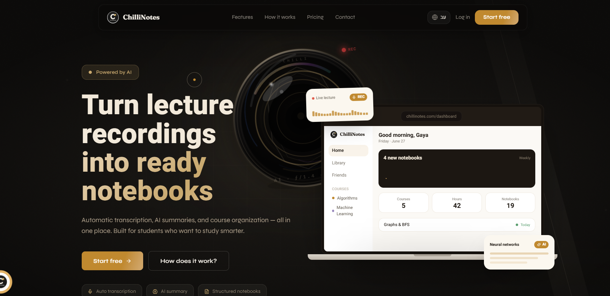
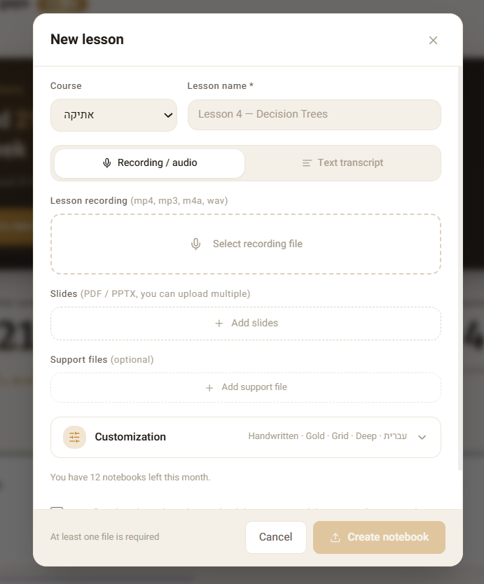
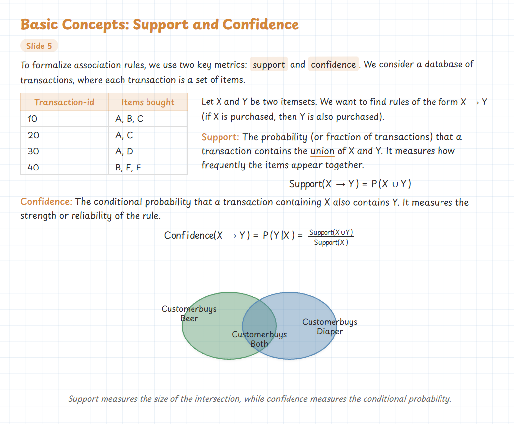
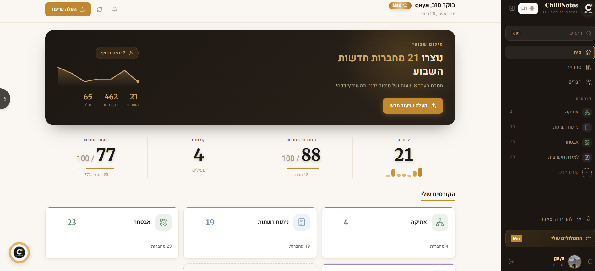
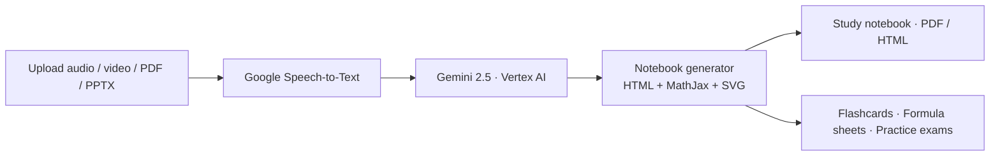

<div align="center">

# 🌶️ ChilliNotes

### Turn lecture recordings into beautiful, study-ready notebooks — with AI.

Upload a recording or slides → get a structured notebook with summaries, definitions, formulas, diagrams, flashcards, practice exams, and more, in minutes.

<br/>

**🚀 Live:** [chillinotes.com](https://chillinotes.com)

<p>
  
  
  
  
  
  
</p>



</div>

---

## 🎬 Demo

<p align="center"></p>

▶️ **Try it live: [chillinotes.com](https://chillinotes.com)**

---

## ✨ Overview

Students lose hours rewatching lectures, reorganizing scattered notes, and rewriting summaries. **ChilliNotes automates the whole loop:** record (or upload audio/video/PDF/PPTX), and an AI pipeline returns a clean, structured notebook you can actually study from — plus flashcards, formula sheets, and practice exams generated from your own material.

Fully **RTL (Hebrew-first)** with English support.

---

## 🎯 Features

- **AI notebooks** — chapter structure, key concepts, definitions, bullet summaries, highlighted formulas, and inline SVG diagrams. Export to HTML or PDF.
- **Accurate transcription** — Hebrew + English, speaker hints, automatic punctuation (Google Speech-to-Text).
- **Real understanding, not just summarizing** — Gemini extracts concepts, links topics, and builds study material with an explicit topic-coverage pass so nothing gets skipped.
- **Study tools** — one-click **flashcards**, **formula sheets**, and **practice exams** (with past-exam references) built from a course's notebooks.
- **Courses & organization** — courses, notebooks, slides, files, and folders in one place, with fast search and a ⌘K command palette.
- **Collaboration** — add friends, share notebooks (read-only), in-app + email notifications.
- **Customizable notebooks** — accent color, paper style, detail level, and a font picker (including self-hosted Hebrew handwriting fonts).

<p align="center">
  
  
  
</p>

---

## 🏗 Architecture

The Next.js app handles auth, data, and uploads; heavy generation runs on a separate **Cloud Run** worker so requests never block on long AI jobs.



```text
Browser ─▶ Next.js (Vercel)
             ├─ Supabase Auth + Postgres (RLS)
             ├─ Google Cloud Storage (signed uploads)
             └─▶ Cloud Run worker
                   ├─ Speech-to-Text
                   ├─ Gemini 2.5 (Vertex AI)
                   └─ Notebook generator ─▶ PDF / HTML + study tools
```

> _Optional: drop a polished `docs/architecture.png` / `docs/pipeline.png` in `docs/` and embed them here if you want custom diagrams._

---

## ⚙️ Tech Stack

| Layer | Technology |
| --- | --- |
| Framework | Next.js 15 (App Router) |
| Language | TypeScript |
| UI | Tailwind CSS · Radix UI · Framer Motion · lucide-react |
| Auth | Supabase Auth (Google OAuth + email) |
| Database | PostgreSQL (Supabase) with Row-Level Security |
| Storage | Google Cloud Storage (signed uploads) |
| Transcription | Google Speech-to-Text |
| AI | Vertex AI — Gemini 2.5 |
| Processing | Google Cloud Run (async pipeline) |
| Email | Resend |
| Hosting | Vercel |

---

## 🔬 Engineering highlights

A few things I'm happy with (and happy to talk through):

- **Decoupled async pipeline** — uploads return immediately; a Cloud Run worker transcribes, analyzes, and renders, while the client polls lightweight status and updates live.
- **Two-pass topic coverage** — a cheap first pass enumerates every topic in the transcript as a checklist that the generation pass must satisfy, which sharply reduces silently-skipped material.
- **Notebook rendering** — deterministic HTML templates with MathJax for formulas and inline SVG for diagrams, themeable via CSS variables (accent color, paper, font) injected per notebook.
- **Security** — Supabase Row-Level Security per user/role, signed GCS upload URLs, server-enforced quotas and paid-feature gating.
- **RTL-first design system** — a single `--st-*` token palette + Hebrew-aware typography (real-weight headings, `unicode-bidi: plaintext` for mixed Hebrew/English/numbers), self-hosted Hebrew handwriting fonts embedded into exported notebooks.

---

## 🚀 Local development

```bash
git clone https://github.com/gayagur/chillinotes.git
cd chillinotes
npm install
npm run dev
```

Then open http://localhost:3000.

### Environment variables

```env
# Supabase
NEXT_PUBLIC_SUPABASE_URL=
NEXT_PUBLIC_SUPABASE_ANON_KEY=
SUPABASE_SERVICE_ROLE_KEY=

# Google Cloud / Vertex AI
GOOGLE_CLOUD_PROJECT_ID=
GCS_BUCKET_UPLOADS=
VERTEX_AI_LOCATION=us-central1
VERTEX_AI_MODEL=gemini-2.5-flash

# Email
RESEND_API_KEY=
```

---

## 📄 License

© 2026 Gaya Gur. All rights reserved. Source-available for viewing and evaluation — see [LICENSE](LICENSE).

<div align="center">
<br/>
Made by a student, for students — built with ☕, AI, and too many late-night lectures.

**[chillinotes.com](https://chillinotes.com)**
</div>
